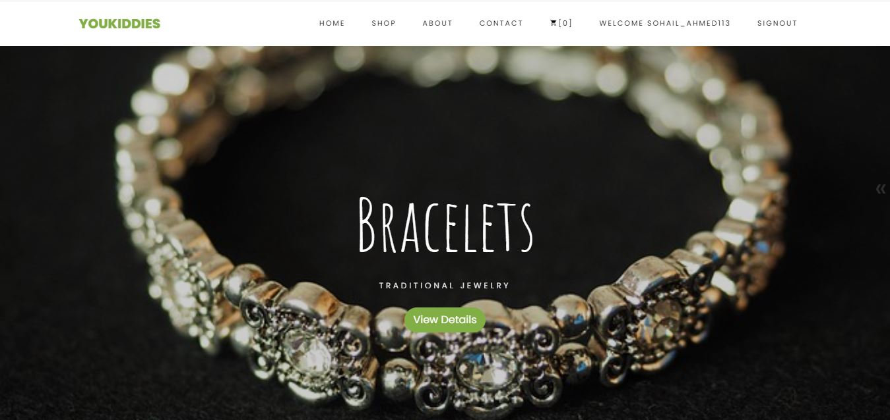
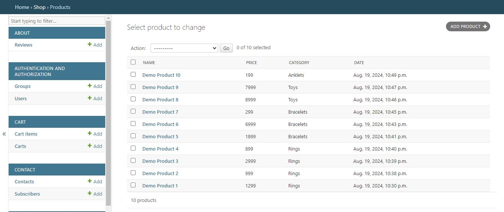
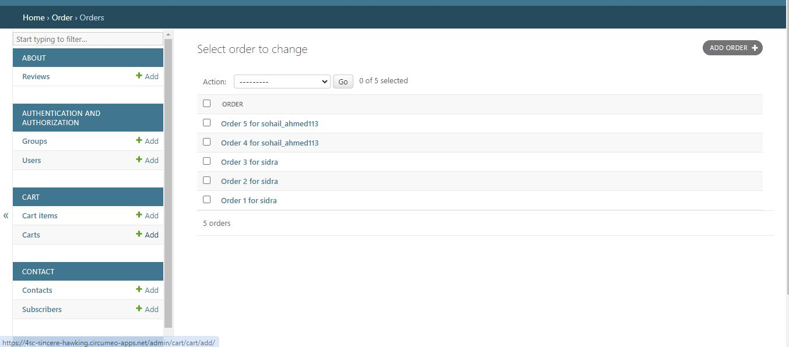

# [Live](https://4sc-sincere-hawking.circumeo-apps.net/)

# YouKiddies - E-commerce Website for Small Businesses and Startups

YouKiddies is an e-commerce platform tailored for small businesses and startups. This project was developed to provide a robust and scalable online presence for businesses looking to sell products and manage their inventory dynamically. The platform offers a user-friendly interface, both for customers shopping online and for administrators managing products, categories, and orders.

## Overview


[](https://youtu.be/fVSG3OBr9Og)

## Features

### 1. Dynamic Product Management
- **Admin Panel:** The admin panel allows business owners to manage products, categories, and catalogs effortlessly. Add, edit, or remove products and categories with ease, ensuring your inventory is always up-to-date.

### 2. Responsive Design
- **Mobile-Friendly:** The website is fully responsive, ensuring a seamless shopping experience across all devices, including desktops, tablets, and smartphones.

### 3. Interactive User Experience
- **Returns & Exchange Policy:** An interactive accordion-style Returns & Exchange page provides clear and concise policy information to customers.
- **Checkout Process:** A smooth and intuitive checkout process with options for standard shipping across Pakistan.
- **Shipping Information:** A clear and straightforward shipping information page with a flat-rate shipping cost.

### 4. Secure Payment Integration (Currently Working)
- **JazzCash Integration:** The website includes secure payment options, making it easy for customers to complete their purchases.

- **Cash On Delivery** Making it easy for customers to complete their purchases.

## Technologies Used

- **Backend:** Django (Python)
- **Frontend:** HTML, CSS, Bootstrap 5
- **Database:** SQLite (for development)
- **Payment Gateway:** JazzCash

## Installation

1. **Clone the repository:**
   ```bash
   git clone https://github.com/Sohail342/E-commerce_Django.git
   cd youkiddies
   ```

2. **Create a virtual environment and activate it:**
    ```bash
    python -m venv venv
    Source venv/bin/activate  # On Windows use `venv\Scripts\activate`
    ```

3. **Install the required dependencies:**
    ```bash
    pip install -r requirements.txt
    ```

4. **Apply the migrations:**
    ```bash
    python manage.py migrate
    ```
5. **Run the development server:**
    ```bash
    python manage.py runserver

    ```
6. **Access the website:**
    Open http://127.0.0.1:8000/ in your web browser.

## Usage

- **Admin Panel:** Access the admin panel at http://127.0.0.1:8000/admin/ to manage products, categories, and orders.

- **Product Management:** Add or update products and categories directly from the admin interface.

## For Admin
### Products



### Orders



[**And many mores**](https://4sc-sincere-hawking.circumeo-apps.net/)

## Contact

If you have any questions or feedback, feel free to reach out:

<p align="left">
<a href="https://wa.me/+923428041928" target="blank"></a>
<a href="https://www.hackerrank.com/sohail_ahmad342" target="blank"></a>
<a href="https://www.linkedin.com/in/sohailahmad3428041928/" target="blank"></a>
<a href="https://instagram.com/sohail_ahmed113" target="blank"></a>
<a href="mailto:sohailahmed34280@gmail.com" target="blank"></a>
</p>
